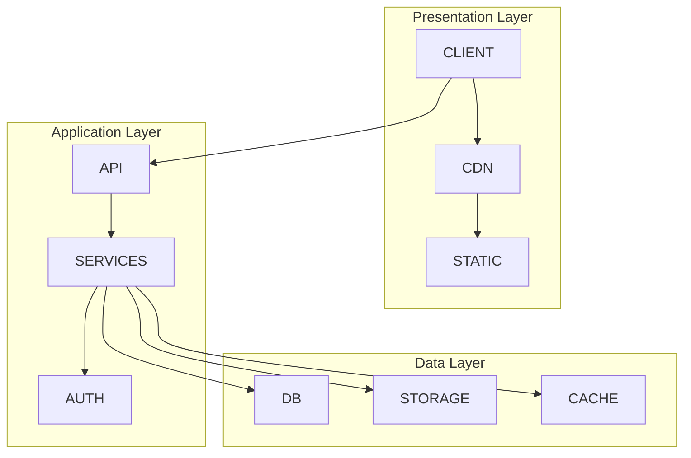
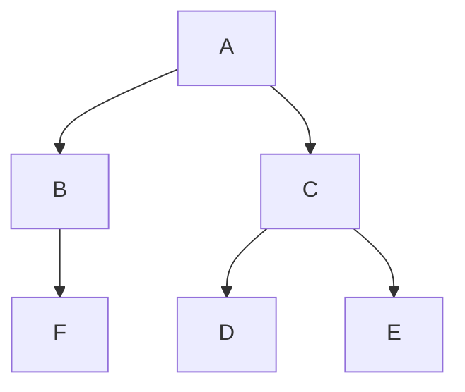
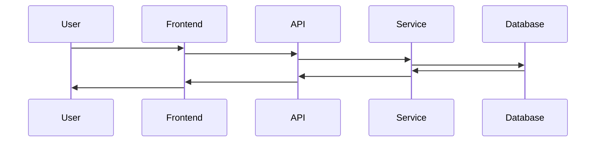
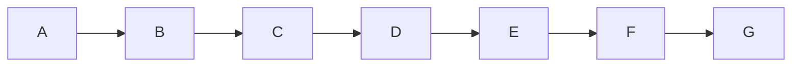

# System Architecture

## 🏗️ Overview

wezterm-parallel is built using  architecture.



## 🧠 Design Philosophy

### Core Principles

| Principle | Description | Implementation Impact |
|-----------|-------------|---------------------|
| **** |  |  |
| **** |  |  |
| **** |  |  |
| **** |  |  |

### Architectural Decisions

#### 1. 
**Decision**: 

**Rationale**:
- 
- 
- 

**Trade-offs**:
- : 
- : 

#### 2. 
**Decision**: 

**Rationale**:
- 
- 

## 📁 Project Structure

### Directory Layout

```
project-root/
├── packages/              # Monorepo packages
│   ├── frontend/         # Frontend application
│   ├── backend/          # Backend services
│   └── shared/           # Shared utilities
├── infrastructure/       # Infrastructure as Code
│   ├── lib/
│   │   └── stacks/      # Infrastructure stacks
│   └── test/            # Infrastructure tests
├── docs/                # Documentation
└── scripts/             # Utility scripts
```

### Module Dependencies



## 🔄 Data Flow

### 



### 


## 📊 Data Models

### Database Schema

#### 
```typescript
interface  {
  id: string;
  // Add fields
  createdAt: Date;
  updatedAt: Date;
}
```

#### 
```typescript
interface  {
  id: string;
  // Add fields
  createdAt: Date;
  updatedAt: Date;
}
```

### API Models

```typescript
// Request/Response models
interface  {
  // Define structure
}

interface  {
  // Define structure
}
```

## 🔧 Service Architecture

### Service Organization

```
services/
├── auth/              # Authentication service
├── user/              # User management
├── /        # 
├── /        # 
└── shared/            # Shared utilities
```

### Service Communication

- **Protocol**: 
- **Format**: 
- **Authentication**: 

## 🚀 Performance Considerations

### Optimization Strategies

1. **Caching**
   - 
   - 

2. **Database Optimization**
   - 
   - 

3. **Network Optimization**
   - 
   - 

### Scalability Patterns

- **Horizontal Scaling**: 
- **Load Balancing**: 
- **Rate Limiting**: 

## 🔒 Security Architecture

### Security Layers

1. **Network Security**
   - 
   - 

2. **Application Security**
   - 
   - 

3. **Data Security**
   - 
   - 

### Authentication & Authorization

```typescript
// Auth flow example
interface AuthFlow {
  authenticate: (credentials: Credentials) => Promise<Token>;
  authorize: (token: Token, resource: Resource) => Promise<boolean>;
  refresh: (refreshToken: string) => Promise<Token>;
}
```

## 📈 Monitoring & Observability

### Metrics Collection

- **Application Metrics**: 
- **Infrastructure Metrics**: 
- **Business Metrics**: 

### Logging Strategy

```typescript
// Logging levels and structure
enum LogLevel {
  DEBUG = 'debug',
  INFO = 'info',
  WARN = 'warn',
  ERROR = 'error',
}

interface LogEntry {
  timestamp: Date;
  level: LogLevel;
  message: string;
  context: Record<string, any>;
}
```

### Alerting Rules

| Alert | Condition | Severity | Action |
|-------|-----------|----------|--------|
|  |  | High/Medium/Low |  |
|  |  | High/Medium/Low |  |

## 🧪 Testing Strategy

### Testing Levels

1. **Unit Tests**
   - Coverage target: %
   - Framework: 

2. **Integration Tests**
   - Scope: 
   - Framework: 

3. **End-to-End Tests**
   - Scenarios: 
   - Framework: 

### Test Structure

```typescript
// Example test structure
describe('', () => {
  describe('', () => {
    it('should ', () => {
      // Test implementation
    });
  });
});
```

## 🚢 Deployment Architecture

### Environments

- **Development**: 
- **Staging**: 
- **Production**: 

### Deployment Pipeline



### Infrastructure as Code

- **Tool**: 
- **State Management**: 
- **Secret Management**: 

## 📚 Related Documentation

- **Development Guide**: (../CONTRIBUTING.md)
- **API Documentation**: 
- **Deployment Guide**: 
- **Security Guidelines**: 