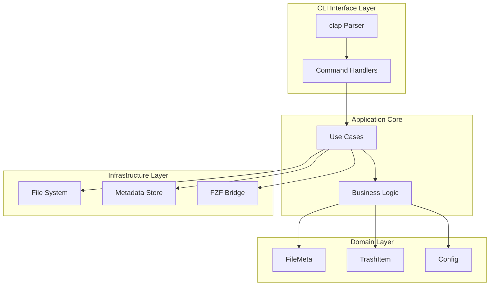
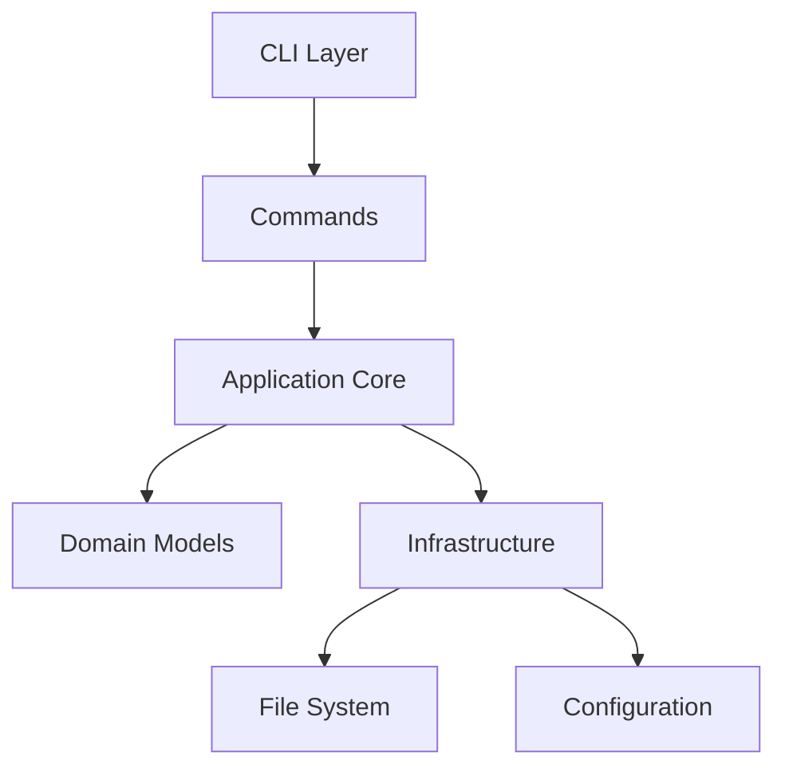
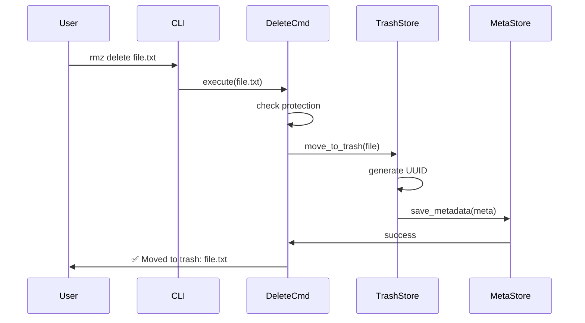
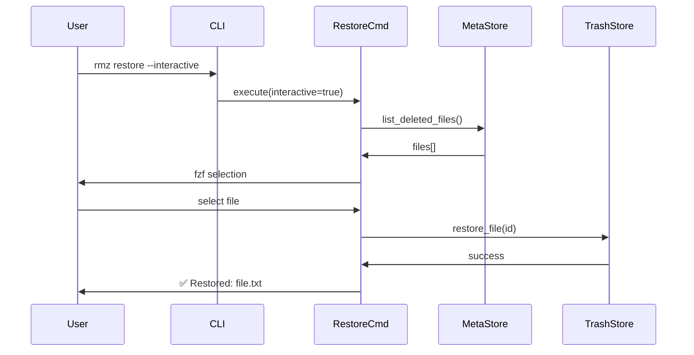
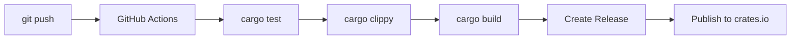

# System Architecture

## 🏗️ Overview

rmz is built using a layered architecture that separates concerns between CLI interface, business logic, and infrastructure.



## 🧠 Design Philosophy

### Core Principles

| Principle | Description | Implementation Impact |
|-----------|-------------|---------------------|
| **分離の関心** | 各層は独立した責任を持つ | traitを使った抽象化で依存性注入 |
| **テスタビリティ** | 全てのコンポーネントがテスト可能 | mockを使った単体テスト |
| **安全性** | 誤操作からユーザーを守る | dry-run、確認プロンプト |
| **拡張性** | 将来の機能追加が容易 | プラグインシステムを検討 |

### Architectural Decisions

#### 1. JSONベースのメタデータ管理
**Decision**: 初期実装ではJSONファイルでメタデータを管理

**Rationale**:
- ヒューマンリーダブルでデバッグが容易
- 実装がシンプル
- ユーザーが直接編集可能

**Trade-offs**:
- ○: 透明性が高く、バックアップが簡単
- ×: 大量データ時のパフォーマンス

#### 2. TrashZoneの独立管理
**Decision**: OS標準ゴミ箱とは別に独自のTrashZoneを実装

**Rationale**:
- 完全な制御が可能
- クロスプラットフォームで一貫した動作

## 📁 Project Structure

### Directory Layout

```
rmz/
├── src/
│   ├── main.rs          # エントリポイント
│   ├── cli.rs           # clap定義
│   ├── commands/        # サブコマンド実装
│   │   ├── delete.rs
│   │   ├── restore.rs
│   │   ├── list.rs
│   │   └── mod.rs
│   ├── domain/          # ドメインモデル
│   │   ├── file_meta.rs
│   │   ├── trash_item.rs
│   │   └── mod.rs
│   ├── infra/           # インフラ層
│   │   ├── trash_store.rs
│   │   ├── meta_store.rs
│   │   ├── config.rs
│   │   └── mod.rs
│   └── utils.rs
├── tests/               # 統合テスト
├── docs/                # ドキュメント
└── Cargo.toml
```

### Module Dependencies



## 🔄 Data Flow

### 削除フロー (rmz delete)



### 復元フロー (rmz restore)



## 📊 Data Models

### Domain Models

#### FileMeta
```rust
#[derive(Serialize, Deserialize, Debug)]
struct FileMeta {
    id: Uuid,
    original_path: PathBuf,
    deleted_at: DateTime<Utc>,
    size: u64,
    permissions: u32,
    tags: Vec<String>,
}
```

#### TrashItem
```rust
struct TrashItem {
    meta: FileMeta,
    trash_path: PathBuf,
}
```

#### Config
```rust
#[derive(Serialize, Deserialize)]
struct Config {
    trash_path: PathBuf,
    protected_paths: Vec<PathBuf>,
    auto_clean_days: Option<u32>,
    max_trash_size: Option<u64>,
}
```

### CLI Commands

```rust
#[derive(Parser)]
#[command(name = "rmz")]
#[command(about = "Safe file deletion with recovery")]
struct Cli {
    #[command(subcommand)]
    command: Commands,
}

#[derive(Subcommand)]
enum Commands {
    Delete {
        #[arg(required = true)]
        paths: Vec<PathBuf>,
        #[arg(short, long)]
        force: bool,
        #[arg(long)]
        dry_run: bool,
    },
    Restore {
        #[arg(conflicts_with = "interactive")]
        file: Option<String>,
        #[arg(short, long)]
        interactive: bool,
    },
    List {
        #[arg(long)]
        json: bool,
        #[arg(long)]
        since: Option<String>,
    },
}
```

## 🔧 Service Architecture

### TrashZone Structure

```
~/.local/share/rmz/
├── trash/
│   ├── 2024-06-23/
│   │   ├── <uuid>.file      # 実ファイル
│   │   └── <uuid>.meta.json # メタデータ
│   └── 2024-06-24/
├── metadata/
│   └── index.json           # インデックス
├── logs/
│   └── operations.log       # 操作ログ
└── config.toml              # 設定ファイル
```

### Metadata Format

```json
{
  "id": "550e8400-e29b-41d4-a716-446655440000",
  "original_path": "/home/user/documents/report.pdf",
  "deleted_at": "2024-06-23T10:30:00Z",
  "size": 1048576,
  "permissions": 644,
  "tags": ["manual", "project-x"],
  "checksum": "sha256:..."
}
```

## 🚀 Performance Considerations

### Optimization Strategies

1. **ファイル操作**
   - 非同期I/Oの活用 (tokio::fs)
   - バッチ処理で複数ファイルを効率的に処理

2. **メタデータ管理**
   - インデックスファイルで高速検索
   - 日付別ディレクトリでファイル数を分散

3. **メモリ使用**
   - 大きなファイルはストリーミング処理
   - メタデータのレイジーロード

### Scalability Patterns

- **ファイル数のスケール**: 日付別ディレクトリで管理
- **メタデータのスケール**: SQLiteへの移行オプション
- **バックアップ**: クラウドストレージへの非同期アップロード

## 🔒 Security Architecture

### Security Layers

1. **ファイルアクセス**
   - 元のファイル権限を保持
   - TrashZoneはユーザー専用領域

2. **保護機能**
   - システムファイルの削除拒否
   - dry-runモードでの確認

3. **データ保護**
   - 設定ファイルは600権限
   - チェックサムでデータ整合性確認

### Authentication & Authorization

```rust
// Protection example
trait ProtectionChecker {
    fn is_protected(&self, path: &Path) -> bool;
    fn add_protected_path(&mut self, path: PathBuf) -> Result<()>;
    fn remove_protected_path(&mut self, path: &Path) -> Result<()>;
}
```

## 📈 Monitoring & Observability

### Metrics Collection

- **操作メトリクス**: 削除数、復元数、エラー率
- **ストレージメトリクス**: TrashZoneサイズ、ファイル数
- **パフォーマンス**: コマンド実行時間

### Logging Strategy

```rust
// Logging structure
use tracing::{info, warn, error};

#[derive(Debug)]
struct OperationLog {
    timestamp: DateTime<Utc>,
    operation: String,
    path: PathBuf,
    result: Result<(), String>,
    user: String,
}
```

### Alerting Rules

| Alert | Condition | Severity | Action |
|-------|-----------|----------|--------|
| TrashZone容量 | 80%超過 | High | 自動クリーンアップ提案 |
| 保護ファイル削除試行 | 発生時 | Medium | ログ記録、拒否 |

## 🧪 Testing Strategy

### Testing Levels

1. **Unit Tests**
   - Coverage target: 80%
   - Framework: 内蔵#[test]

2. **Integration Tests**
   - Scope: コマンド全体の動作
   - Framework: assert_cmd

3. **End-to-End Tests**
   - Scenarios: 削除→復元フロー
   - Framework: tempfile + custom harness

### Test Structure

```rust
#[cfg(test)]
mod tests {
    use super::*;
    use tempfile::TempDir;

    #[test]
    fn test_delete_file() {
        let temp_dir = TempDir::new().unwrap();
        let file_path = temp_dir.path().join("test.txt");
        // Test implementation
    }
}
```

## 🚢 Deployment Architecture

### Release Channels

- **Nightly**: 毎日ビルド、最新機能
- **Beta**: リリース候補、テスト版
- **Stable**: 安定版、パッケージマネージャー配布

### Deployment Pipeline



### Distribution

- **Cargo**: crates.ioでの公開
- **Homebrew**: Formulaの自動更新
- **Binary**: GitHub Releasesでの配布

## 📚 Related Documentation

- **Development Guide**: [../CONTRIBUTING.md](../CONTRIBUTING.md)
- **API Documentation**: https://docs.rs/rmz
- **User Guide**: [../README.md](../README.md)
- **Tech Stack**: [tech-stack.md](tech-stack.md)