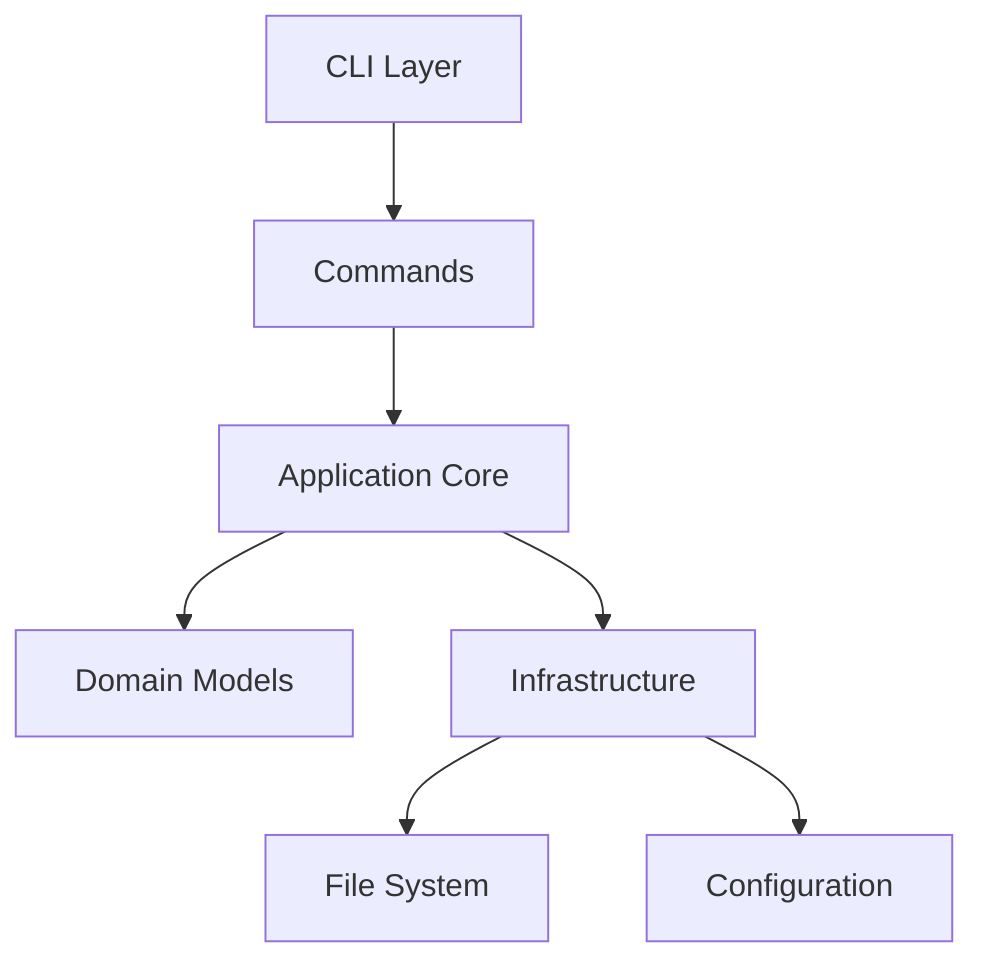

# System Architecture

## System Overview

rmz is a safe, modern replacement for the `rm` command, implemented as a Rust CLI tool. The architecture is layered for clarity, testability, and maintainability.

- **CLI Layer**: Handles command-line parsing and user interaction (clap v4)
- **Application Core**: Implements business logic and use cases
- **Domain Layer**: Defines core data models (FileMeta, TrashItem, Config, OperationLog)
- **Infrastructure Layer**: Handles file system operations, metadata storage, and external integrations

---

## Directory & Module Structure

```
rmz/
├── src/            # Rust source code
│   ├── cli.rs      # CLI entry and argument parsing
│   ├── commands/   # Subcommand implementations
│   ├── core/       # Core business logic
│   ├── domain/     # Domain models (FileMeta, TrashItem, Config, etc.)
│   ├── infra/      # Infrastructure (file system, metadata, config)
│   └── utils/      # Utility functions
├── tests/          # Integration tests
├── docs/           # Documentation
│   └── dev/        # Developer documentation
├── scripts/        # Utility scripts
├── Cargo.toml      # Project manifest
```

- **cli.rs**: CLI entry point, argument parsing (clap)
- **commands/**: Each subcommand (delete, restore, list, status, etc.) in its own file
- **core/**: Business logic, use cases, error handling
- **domain/**: Data models and types
- **infra/**: File system, metadata store, config manager, logger
- **utils/**: Common utilities (parsers, helpers)
- **tests/**: Integration tests; unit tests are in each module as `mod tests`

---

## Technology Stack

- **Language**: Rust 2021 Edition (safety, performance, cross-platform)
- **CLI Framework**: clap v4 (modern, ergonomic CLI parsing)
- **Serialization**: serde, serde_json (JSON metadata)
- **Date/Time**: chrono (UTC timestamps)
- **File Operations**: std::fs (native), fs_extra (optional, advanced)
- **Unique IDs**: uuid (collision-free identification)
- **Testing**: cargo test, mockall, tempfile, assert_cmd
- **Security**: cargo-audit (vulnerability checks)
- **CI/CD**: GitHub Actions (testing, linting, release)
- **Documentation**: Markdown in `docs/` and `docs/dev/`

---

## Data Flow

### Safe Deletion (`rmz delete`)
1. User runs `rmz delete <file>`
2. CLI parses command and calls the delete handler
3. Handler checks for protected paths
4. File is moved to TrashZone (`~/.rmz/trash/`)
5. Metadata is recorded (JSON)
6. User receives confirmation

### Restore (`rmz restore`)
1. User runs `rmz restore <id|pattern>`
2. CLI parses command and calls the restore handler
3. Handler looks up metadata and file in TrashZone
4. File is restored to original location
5. Metadata is updated
6. User receives confirmation

---

## Domain Models (Rust)

```rust
struct FileMeta {
    id: Uuid,
    original_path: PathBuf,
    deleted_at: DateTime<Utc>,
    size: u64,
    permissions: u32,
    tags: Vec<String>,
}

struct TrashItem {
    meta: FileMeta,
    trash_path: PathBuf,
}

struct Config {
    trash_path: PathBuf,
    protected_paths: Vec<PathBuf>,
    auto_clean_days: Option<u32>,
    max_trash_size: Option<u64>,
}
```

---

## Key Architectural Decisions

- **JSON-based metadata**: Simple, human-readable, easy to debug
- **Dedicated TrashZone**: Full control, not tied to OS trash
- **Layered separation**: Each layer has a single responsibility
- **Testability**: All components are designed for unit and integration testing

---

## Diagram



---

## Notes
- All code, documentation, and commit messages are in English
- Follows TDD: tests are written before implementation
- Designed for cross-platform use (Linux, macOS, Windows)
- See `docs/dev/test-strategy.md` for testing details
