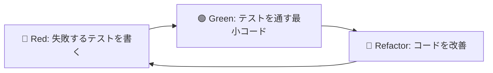

# テスト戦略

## 概要

rmz はファイルの安全な削除・復元を扱う重要なツールのため、包括的なテスト戦略が必要です。
TDD（テスト駆動開発）を採用し、機能実装前にテストを作成します。

## テストピラミッド

```
        /\
       /  \
      / E2E \     少数：実際のCLI実行テスト
     /______\
    /        \
   /Integration\   中程度：コマンド統合テスト
  /__________\
 /            \
/  Unit Tests  \   多数：個別機能の単体テスト
/______________\
```

## テストレベル

### 1. Unit Tests（単体テスト）
- **対象**: 個別関数・メソッド・構造体
- **フレームワーク**: Rust内蔵 `#[test]`
- **モック**: `mockall`
- **目標カバレッジ**: 80%以上

#### テスト対象の例
```rust
// Domain層
#[test]
fn test_file_meta_creation() {
    let meta = FileMeta::new("/home/user/test.txt");
    assert_eq!(meta.original_path, Path::new("/home/user/test.txt"));
    assert!(meta.id != Uuid::nil());
}

// Infrastructure層
#[test] 
fn test_trash_store_save() {
    let mut mock_store = MockTrashStore::new();
    mock_store
        .expect_save()
        .times(1)
        .returning(|_| Ok(()));
    
    let result = mock_store.save(&file_meta);
    assert!(result.is_ok());
}
```

### 2. Integration Tests（統合テスト）
- **対象**: コマンド間の連携、ファイルI/O
- **フレームワーク**: `tests/` ディレクトリ
- **環境**: `tempfile` による一時ディレクトリ
- **実行**: `cargo test --test integration`

#### テスト対象の例
```rust
#[test]
fn test_delete_and_restore_workflow() {
    let temp_dir = TempDir::new().unwrap();
    let test_file = temp_dir.path().join("test.txt");
    fs::write(&test_file, "test content").unwrap();
    
    // 削除
    let delete_result = delete_command(&test_file, false);
    assert!(delete_result.is_ok());
    assert!(!test_file.exists());
    
    // 復元
    let restore_result = restore_command_by_name("test.txt");
    assert!(restore_result.is_ok());
    assert!(test_file.exists());
    assert_eq!(fs::read_to_string(&test_file).unwrap(), "test content");
}
```

### 3. End-to-End Tests（E2Eテスト）
- **対象**: 実際のCLI実行
- **フレームワーク**: `assert_cmd`
- **環境**: 実際のバイナリを使用
- **実行**: `cargo test --test e2e`

#### テスト対象の例
```rust
#[test]
fn test_cli_delete_command() {
    let temp_dir = TempDir::new().unwrap();
    let test_file = temp_dir.path().join("test.txt");
    fs::write(&test_file, "content").unwrap();
    
    Command::cargo_bin("rmz")
        .unwrap()
        .arg("delete")
        .arg(&test_file)
        .arg("--force")
        .assert()
        .success()
        .stdout(predicate::str::contains("Moved to trash"));
        
    assert!(!test_file.exists());
}
```

## テストデータ管理

### Fixtures（テストデータ）
```rust
pub struct TestFixtures {
    pub temp_dir: TempDir,
    pub test_files: Vec<PathBuf>,
    pub config: Config,
}

impl TestFixtures {
    pub fn new() -> Self {
        let temp_dir = TempDir::new().unwrap();
        let mut test_files = Vec::new();
        
        // 各種テストファイルを作成
        let text_file = temp_dir.path().join("document.txt");
        fs::write(&text_file, "Sample text content").unwrap();
        test_files.push(text_file);
        
        let binary_file = temp_dir.path().join("image.png");
        fs::write(&binary_file, &[0x89, 0x50, 0x4E, 0x47]).unwrap();
        test_files.push(binary_file);
        
        let config = Config {
            trash_path: temp_dir.path().join(".rmz"),
            protected_paths: vec![PathBuf::from("/etc")],
            auto_clean_days: Some(30),
            max_trash_size: Some(1024 * 1024 * 100), // 100MB
        };
        
        Self { temp_dir, test_files, config }
    }
}
```

### Mock Objects
```rust
use mockall::mock;

mock! {
    TrashStore {}
    
    impl TrashStoreInterface for TrashStore {
        fn save(&self, meta: &FileMeta) -> Result<()>;
        fn restore(&self, id: &Uuid) -> Result<()>;
        fn list(&self) -> Result<Vec<FileMeta>>;
        fn purge(&self, id: &Uuid) -> Result<()>;
    }
}

mock! {
    FileSystem {}
    
    impl FileSystemInterface for FileSystem {
        fn exists(&self, path: &Path) -> bool;
        fn copy(&self, from: &Path, to: &Path) -> Result<()>;
        fn remove(&self, path: &Path) -> Result<()>;
    }
}
```

## TDDワークフロー

### Red-Green-Refactor サイクル



### 実装手順例：delete コマンド

1. **Red**: 失敗するテストを作成
```rust
#[test]
fn test_delete_command_moves_file_to_trash() {
    let fixtures = TestFixtures::new();
    let file_path = &fixtures.test_files[0];
    
    let result = delete_file(file_path, &fixtures.config);
    
    assert!(result.is_ok());
    assert!(!file_path.exists()); // ファイルが削除されている
    // TrashZoneにファイルが移動されている
    assert!(fixtures.config.trash_path.join("2024-06-23").exists());
}
```

2. **Green**: テストを通す最小実装
```rust
pub fn delete_file(path: &Path, config: &Config) -> Result<()> {
    // 最小限の実装
    std::fs::remove_file(path)?;
    Ok(())
}
```

3. **Refactor**: 本格的な実装に改善
```rust
pub fn delete_file(path: &Path, config: &Config) -> Result<()> {
    let meta = FileMeta::from_path(path)?;
    let trash_store = TrashStore::new(&config.trash_path);
    trash_store.save(&meta)?;
    std::fs::remove_file(path)?;
    Ok(())
}
```

## テストカテゴリ

### 正常系テスト
- ファイル削除・復元の基本動作
- 各種ファイル形式（テキスト、バイナリ、シンボリックリンク）
- ディレクトリの削除・復元
- 大量ファイルの処理

### 異常系テスト  
- 存在しないファイルの削除
- 権限のないファイルの削除
- 保護されたパスの削除試行
- ディスク容量不足
- 破損したメタデータファイル

### エッジケース
- 同名ファイルの重複削除
- 特殊文字を含むファイル名
- 非常に長いパス
- 0バイトファイル
- 巨大ファイル（数GB）

### セキュリティテスト
- パストラバーサル攻撃の防止
- 保護パス機能の検証
- 権限チェックの動作確認

## テスト実行環境

### ローカル開発
```bash
# 全テスト実行
cargo test

# 単体テストのみ
cargo test --lib

# 統合テストのみ
cargo test --test integration

# E2Eテストのみ
cargo test --test e2e

# カバレッジ測定
cargo tarpaulin --out Html
```

### CI環境
```yaml
# .github/workflows/test.yml
name: Tests
on: [push, pull_request]

jobs:
  test:
    runs-on: ubuntu-latest
    steps:
      - uses: actions/checkout@v3
      - uses: dtolnay/rust-toolchain@stable
      
      - name: Run unit tests
        run: cargo test --lib
        
      - name: Run integration tests  
        run: cargo test --test integration
        
      - name: Run E2E tests
        run: cargo test --test e2e
        
      - name: Generate coverage
        run: |
          cargo install cargo-tarpaulin
          cargo tarpaulin --out Xml
          
      - name: Upload coverage
        uses: codecov/codecov-action@v3
```

## 継続的改善

### メトリクス監視
- テストカバレッジ率
- テスト実行時間
- テスト失敗率
- テストメンテナンス工数

### 品質基準
- 新機能実装時は必ずテストファースト
- カバレッジ80%以上維持
- E2Eテストは5分以内で完了
- 全テストは1分以内で完了

---

この戦略に基づいて、次のステップでは具体的なテストコードを含むプロジェクト構造を作成します。