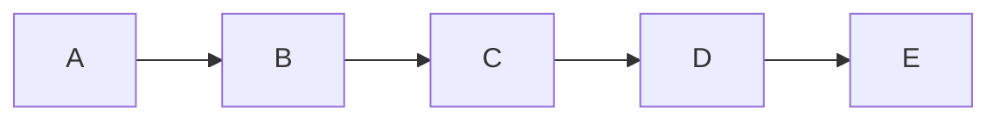

# Product Requirements Document (PRD)

## 1. Product Name

## 2. Executive Summary

### 🎯 Vision

### 🔍 Problem Statement

### 💡 Solution Overview

## 3. Target Audience

### Primary Users
- ****: 
- ****: 
- ****: 

### User Demographics
- Age range: 
- Technical proficiency: 
- Geographic location: 
- Industry/Domain: 

## 4. Value Proposition

> 

### Key Benefits
1. ****: 
2. ****: 
3. ****: 

## 5. Product Requirements

### Must-Have Features (MVP)

| Feature | Description | User Story | Priority |
|---------|-------------|------------|----------|
|  |  | As a , I want to  so that  | P0 |
|  |  | As a , I want to  so that  | P0 |
|  |  | As a , I want to  so that  | P0 |

### Nice-to-Have Features

| Feature | Description | User Story | Priority |
|---------|-------------|------------|----------|
|  |  | As a , I want to  so that  | P1 |
|  |  | As a , I want to  so that  | P2 |

### Future Considerations
- 
- 
- 

## 6. User Journey

### 

### Detailed Flow Description
1. ****: User 
2. ****: System 
3. ****: User 
4. ****: 

## 7. Functional Requirements

### 
- **FR1.1**: 
- **FR1.2**: 
- **FR1.3**: 

### 
- **FR2.1**: 
- **FR2.2**: 

## 8. Non-Functional Requirements

### Performance
- Page load time: <  seconds
- API response time: < ms
- Concurrent users: Support  simultaneous users

### Security
- Authentication: 
- Data encryption: 
- Compliance: 

### Usability
- Mobile responsive
- Accessibility: 
- Browser support: 

### Reliability
- Uptime: %
- Data backup: 
- Disaster recovery: 

## 9. Technical Considerations

### Platform Requirements
- **Frontend**: 
- **Backend**: 
- **Database**: 
- **Infrastructure**: 

### Integration Requirements
- 
- 
- 

### Constraints
- 
- 
- 

## 10. Success Metrics

### Key Performance Indicators (KPIs)

| Metric | Target | Measurement Method |
|--------|--------|-------------------|
|  |  |  |
|  |  |  |
|  |  |  |

### Success Criteria
-  
-  
-  

## 11. Risks and Mitigation

| Risk | Impact | Probability | Mitigation Strategy |
|------|--------|-------------|-------------------|
|  | High/Med/Low | High/Med/Low |  |
|  | High/Med/Low | High/Med/Low |  |
|  | High/Med/Low | High/Med/Low |  |

## 12. Timeline and Milestones

### Development Phases

| Phase | Duration | Key Deliverables |
|-------|----------|-----------------|
| Research & Design |  |  |
| MVP Development |  |  |
| Beta Testing |  |  |
| Launch Preparation |  |  |
| Post-Launch | Ongoing |  |

### Major Milestones
- ****: 
- ****: 
- ****: 
- ****: Go-Live

## 13. Budget Considerations

### Development Costs
- Personnel: 
- Infrastructure: 
- Third-party services: 
- Marketing: 

### Ongoing Operational Costs
- Hosting: 
- Maintenance: 
- Support: 

## 14. Stakeholders

### Internal Stakeholders
- **Product Owner**: 
- **Development Team**: 
- **Design Team**: 
- **QA Team**: 

### External Stakeholders
- **End Users**: 
- **Partners**: 
- **Investors**: 

## 15. Appendices

### A. Glossary
- ****: 
- ****: 

### B. References
- 
- 

### C. Mockups/Wireframes
- 
- 

---

**Document Status**:   
**Version**:   
**Last Updated**:   
**Author**:   
**Reviewers**: 